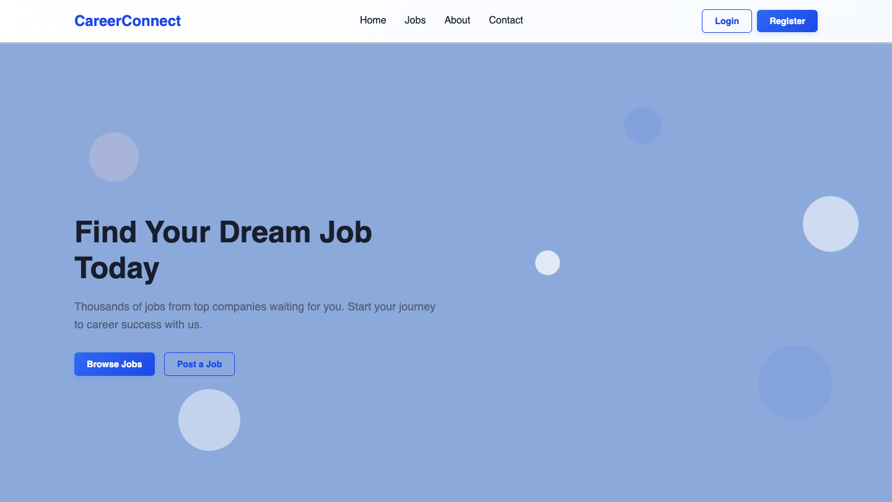
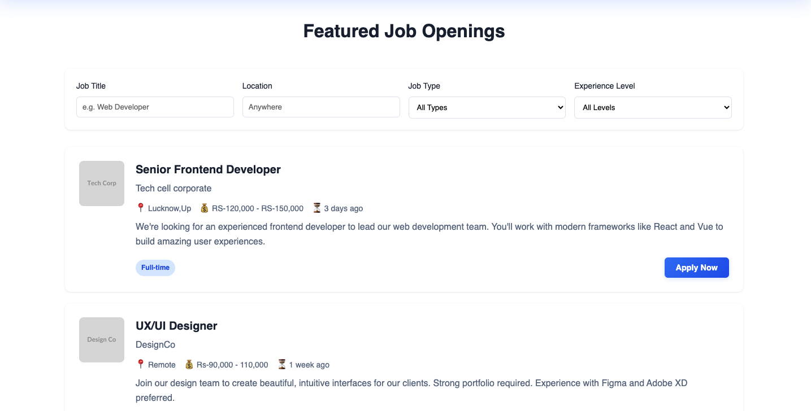
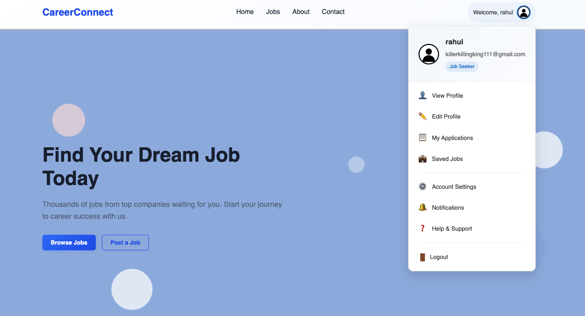
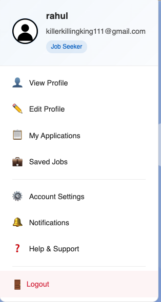
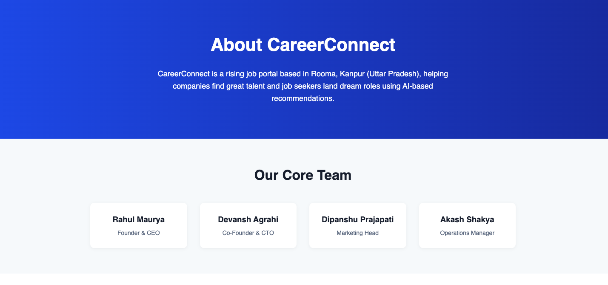

# CareerConnect – Job Portal Web Application

CareerConnect is a full stack web application built using Django, designed to connect job seekers with employers. The platform provides features such as user authentication, job posting, resume management, and dashboard functionality.

---

## Live Demo

https://careerconnect-3z8g.onrender.com/

---

## Overview

CareerConnect is a job portal system that allows users to:

- Register and manage profiles  
- Browse and apply for jobs  
- Upload and manage resumes  
- Access personalized dashboards  

The application follows Django’s MVC (MVT) architecture and is built for scalability and real-world usage.

---

## Tech Stack

- Python  
- Django  
- HTML, CSS, JavaScript  
- SQLite (or your DB)  
- Django Templates  

---

## Project Structure

careerconnect/
├── about/
│ ├── migrations/
│ ├── admin.py
│ ├── apps.py
│ ├── models.py
│ ├── tests.py
│ ├── urls.py
│ └── views.py
│
├── accounts/
│ ├── migrations/
│ ├── admin.py
│ ├── apps.py
│ ├── forms.py
│ ├── models.py
│ ├── tests.py
│ ├── urls.py
│ └── views.py
│
├── careerconnect/ # Main project config
│ ├── init.py
│ ├── asgi.py
│ ├── settings.py
│ ├── urls.py
│ └── wsgi.py
│
├── contact/
│ ├── migrations/
│ ├── admin.py
│ ├── apps.py
│ ├── models.py
│ ├── tests.py
│ ├── urls.py
│ └── views.py
│
├── core/
│ ├── views.py
│ └── urls.py
│
├── customer_dashboard/
│ ├── migrations/
│ ├── admin.py
│ ├── apps.py
│ ├── models.py
│ ├── tests.py
│ ├── urls.py
│ └── views.py
│
├── dashboard/
│ ├── migrations/
│ ├── admin.py
│ ├── apps.py
│ ├── models.py
│ ├── tests.py
│ ├── urls.py
│ └── views.py
│
├── jobs/
│ ├── migrations/
│ ├── admin.py
│ ├── apps.py
│ ├── models.py
│ ├── tests.py
│ ├── urls.py
│ └── views.py
│
├── ml/
│ ├── migrations/
│ ├── admin.py
│ ├── apps.py
│ ├── models.py
│ ├── tests.py
│ └── views.py
│
├── profilename/
│ ├── migrations/
│ ├── admin.py
│ ├── apps.py
│ ├── models.py
│ ├── tests.py
│ └── views.py
│
├── resumes/
│ ├── migrations/
│ ├── admin.py
│ ├── apps.py
│ ├── models.py
│ ├── tests.py
│ └── views.py
│
├── static/
│ ├── about/
│ ├── accounts/
│ ├── contact/
│ ├── core/
│ ├── customer_dashboard/
│ ├── images/
│ ├── js/
│ └── base.css
│
├── staticfiles/ # Collected static files (production)
│
├── templates/
│ ├── about/
│ │ └── about.html
│ ├── accounts/
│ ├── contact/
│ ├── core/
│ │ └── home.html
│ ├── dashboard/
│ ├── job/
│ │ └── company.html
│ ├── jobs/
│ │ ├── c1.html
│ │ └── jobs.html
│ ├── profilename/
│ │ └── profilename.html
│ └── base.html
│
├── manage.py
├── db.sqlite3
├── requirements.txt
├── render.yaml
├── Pipfile
└── Pipfile.lock

---

## Features

- User authentication (login/register/logout)  
- Profile management  
- Job listing and job application system  
- Resume upload and management  
- Dashboard for users  
- Admin panel for managing data  
- Organized Django apps for modular structure  

---

## Modules

- Accounts: User authentication and profile  
- Jobs: Job posting and listings  
- Resumes: Resume upload and management  
- Dashboard: User-specific dashboard  
- Core: Main application logic  
- ML: (Optional) Machine learning module  

---

## Installation & Setup

### 1. Clone the repository

git clone https://github.com/Rahulmaurya1234/your-repo-name.git
cd careerconnect

## 2. Create virtual environment

python -m venv venv
source venv/bin/activate   # Linux/Mac
venv\Scripts\activate      # Windows

## 3. Install dependencies

pip install -r requirements.txt

## 4. Run migrations

python manage.py migrate

## 5. Run server

python manage.py runserver
 
Future Improvements : 
  Advanced job filtering and search
  Recommendation system (ML-based)
  Notification system
  Resume parsing
  Improved UI/UX
  
## Screenshots

  
  

  
  

  

## Author

Rahul Maurya
GitHub: https://github.com/Rahulmaurya1234

Portfolio: https://rahulmaurya1234.github.io/my-portfolio/

Email: rahul2003maurya@gmail.com

This project demonstrates full stack development using Django with modular architecture and real-world job portal features.
